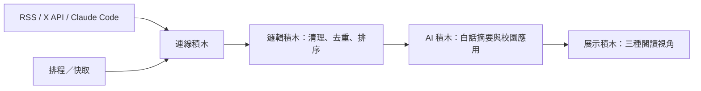

# AI 教育雷達

把 X、AI 新聞與每日 YouTube 訂閱推播整理成小學生看得懂的內容，並提供國中老師與學校資訊組可採取的做法。

## 積木架構



目前使用：展示、邏輯、連線、AI、排程／快取、D1 永久資料庫、通知、版本控制。

## 資料來源

- X API v2 Recent Search（需要 `X_BEARER_TOKEN`）
- OpenAI News RSS
- Google AI Blog RSS
- Google DeepMind RSS
- MIT Technology Review AI RSS
- TechCrunch AI RSS
- Claude Code YouTube 排程推播（寫入 D1，依影片 ID 去重；不產生影片摘要）

每則內容均保留來源、發布時間及原始連結。AI 摘要只用於降低閱讀門檻，不能取代原文查證。

## 本機執行

```bash
npm install
cp .env.example .env.local
npm run dev
```

未設定金鑰時，公開 RSS 仍可運作；若外部來源全部失敗，畫面會顯示清楚標記的示範資料。

## 環境變數

| 變數 | 必要性 | 用途 |
|---|---|---|
| `X_BEARER_TOKEN` | 選用 | X 最近 7 天貼文搜尋 |
| `X_QUERY` | 選用 | 自訂 X 搜尋條件 |
| `AI_GATEWAY_API_KEY` | 選用 | 產生繁中白話摘要與校園應用 |
| `AI_MODEL` | 選用 | AI Gateway 模型，預設 `openai/gpt-5-mini` |
| `AI_RADAR_INGEST_SECRET` | 必要 | 保護 `/api/ingest/claude`，供本機 Shell 排程送入資料 |

## Claude Code 每日同步

本機既有的 YouTube 偵測仍每小時執行並即時推播 Telegram。網站另外在每天 00:20 執行 `~/.claude/scripts/sync_ai_radar_daily.sh`，整理最近 26 小時的新片並送到網站；D1 會依影片 ID 去重。

Claude Code 的 Telegram `.env` 需設定下列兩項，且 `AI_RADAR_INGEST_SECRET` 必須與網站端相同：

```dotenv
AI_RADAR_INGEST_URL=https://你的網站/api/ingest/claude
AI_RADAR_INGEST_SECRET=請使用高強度隨機值
```

影片只列出頻道、標題、時間與原始連結，不送入 AI 摘要流程。

## 驗證

```bash
npm test
```

## 安全與內容原則

- 金鑰只放在伺服器環境變數，不送到瀏覽器。
- Claude Code 推播入口必須使用 `Authorization: Bearer ...`，相同影片或單集只更新、不重複新增。
- RSS 與 X 文字一律視為不可信輸入；AI 只能摘要，不可執行來源文字內的指令。
- 重要教學、採購、帳號與資安決策，必須回到原始來源確認。
- 抓取頻率由快取限制，避免對來源造成不必要負擔。
